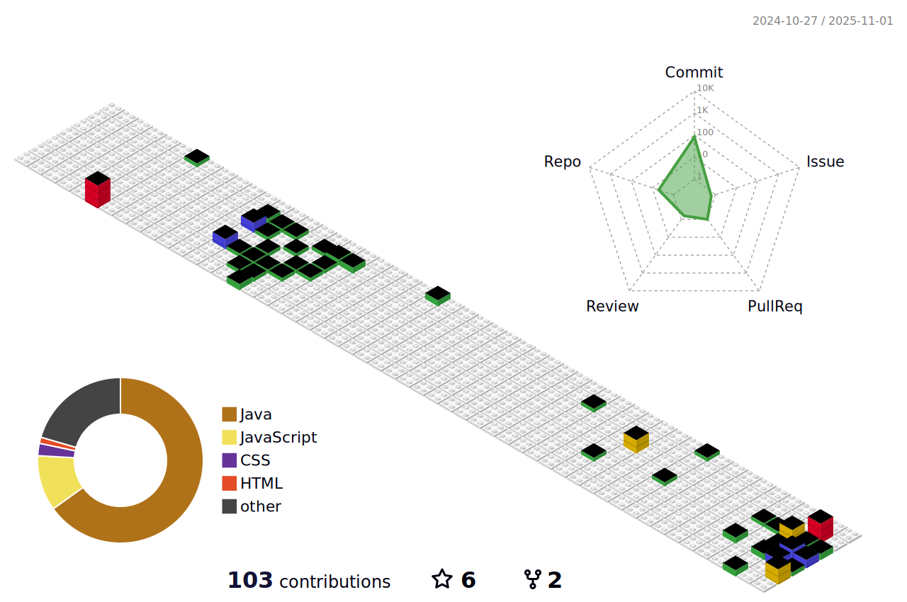

<h1 align="center">João Vitor</h1>

  Desenvolvedor Back End · Professor de TI

---

---

## Sobre

- Atuação em desenvolvimento back end com Java e Spring
- Professor de Tecnologia 
- Graduação em Análise em Desenvolvimento de Sistemas
- Formado em técnico em Desenvolvimento de Sistemas pelo Senai Suíço Brasileiro

## Projetos em destaque

- [Desafio Itaú](https://github.com/JoaoVGomees/desafio-backend-itau) – Implementação de uma API REST utilizando Java com spring, seguindo os requisitos propostos pelo Itaú.
- [API AnimeFlix](https://github.com/JoaoVGomees/APICompleta) – Back end do AnimeFlix, projeto final do curso Técnico.
- [Bikcraft](https://joaovgomees.github.io/bikcraft/) – Página de aluguel de bicicletas elétricas. Back end da página em desenvolvimento.

## Contato

- [LinkedIn](https://www.linkedin.com/in/joaovgomees/)
- [Portfólio](https://joaovgomees.github.io/portfolio-origamid/)
- [Instagram - João Vitor](https://www.instagram.com/__joao78)

---
